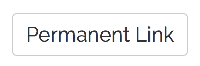

# GFDatabase

## What is it?

It's a theme for [WordPress](https://wordpress.org/) that is designed for storing questions (along with hints and answers) and displaying them to visitors in random order.

## How to get started

You'll need to do a few things to get up and running:

* To use the question/answer feature **YOU MUST CREATE ONE BLANK PAGE** that uses the *Question Feeder* template. You can then customize the introductory spiel under the *Intro* sections of the *Essentials* panel.
* You can make the question/answer page your home page (this is what I always do). Or you can have a different static home page and keep your question feeder at another permalink.
* If you want to show all your blog posts in one place, create a blank page using the *Post List* template. All your posts will be presented here in reverse chronological order.
* Create a navigation menu from the WordPress customizer under the *Menus* panel. Then you can customize it under the *Navigation Bar* section of the *Essentials* panel.

## How to use it

Using the theme is simple: the home page chooses a random question from our database and displays it. Your job is to answer the question. We’ve included an example problem below:

 
Tough right?? It only gets harder from here! There are three buttons below the question:

1. `Hint`: Get a hint for this problem. This will appear as a modal window that overlays the question.
1. `Answer`: View the full solution to this problem. The answer will appear below the question.
1. `Next`: Move on to the next random problem. The question will be replaced with a new one.

Clicking the Answer button will also yield a link to the permanent link to this problem, in case you’d like to share it with someone else or revisit it later:
 

 

The question will appear the same way as it did on the home page (without the Next button, of course).

A few more things:

* `Hint` and `Answer` are optional fields, so some questions may have them and others may not. The buttons will only appear if the corresponding fields are filled out.
* You can find the answer in the source code without pressing the button, as it’s loaded on the page but simply hidden from view. But what’s the fun in that?
* Have fun!